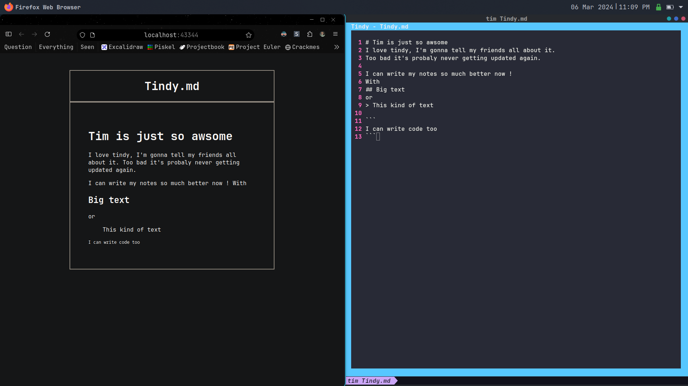

# Tindy

Terminal interface notes, don't yawn, or tindy.md (trust me it rhymes) was built to make it more convenient to take notes with Markdown from the terminal, quickly and easily without the need for configuration. Tindy comes with live preview and an interface made to prevent distractions. Imagine pen and paper, with a keyboard.
